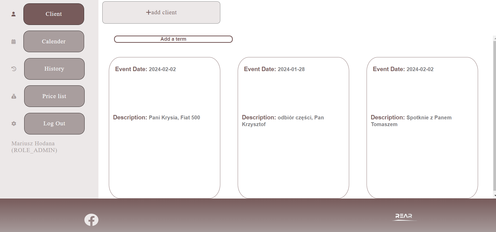

# Car Service

Car Service is an application for managing your car repair shop.

## Table of Contents

1. [Description](#description)
2. [Technologies](#technologies)
3. [Usage](#usage)
4. [Examples](#examples)
5. [Contributing](#contributing)
6. [Authors](#authors)
7. [License](#license)

## Description

This application is created for managing a car repair shop.
The application allows you to add/modify/delete customers, their cars and the car repair history of these cars.
The application uses an external VIN to download information about the car.
Additionally, the application allows you to schedule appointments, repairs and other events.
We can enter our own rates for a given service.

The main objective of the project is to demonstrate programming skills on the backend side, Java and SpringBoot to be specific.

The Frontend is a simple interface with basic information, that provides some of the functionalities implemented in the backend.

## Technologies
- Backend
    - Java
    - Spring Boot
- Database
    - Postgresql
- Container
    - Docker

## Backend
- This application allows us to register new Users, Every new user receives a welcome email.  The first registered account will have Admin rights.  This role lets us create new Users and Admins, has access to information about  Users and delete other accounts.
A standard User only has access to his customers.

- This application allows us to add customers, their cars, which are decoded based on the VIN number using an external API and the car repair history of these cars. 
Additionally, the application allows us to schedule appointments, repairs and other events.
We can enter our own fees for a given service. 

- All the operations are validated on the backend.
- This application has exception handler.
- Jwt tokens are used for user authentication.  

## Frontend
- For demonstration purpose only.

## Database

## Usage
Login page
  

 
Client page 
  

 
History page
  

 
Calendar page
  

 
Price List page
  

 
Add Client page
  

 
Login mobile page 
  

 
Client mobile page 
  

 
History mobile pages
  

 
Calendar mobile page
  

 
Price List mobile page
  

 
Add Client mobile page
  

 
## Examples
(Now, the car is not added manually but through a VIN decoder API.)

[overview](https://vimeo.com/905734189?share=copy)

## Contributing

This application is still in development. 

## Authors

Mariusz Hodana

## License

///

